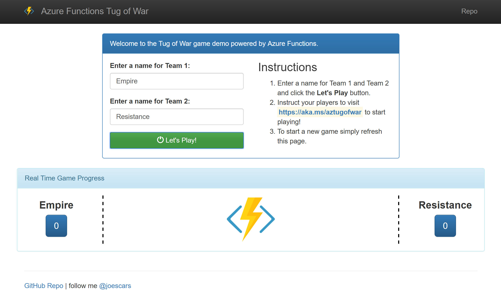
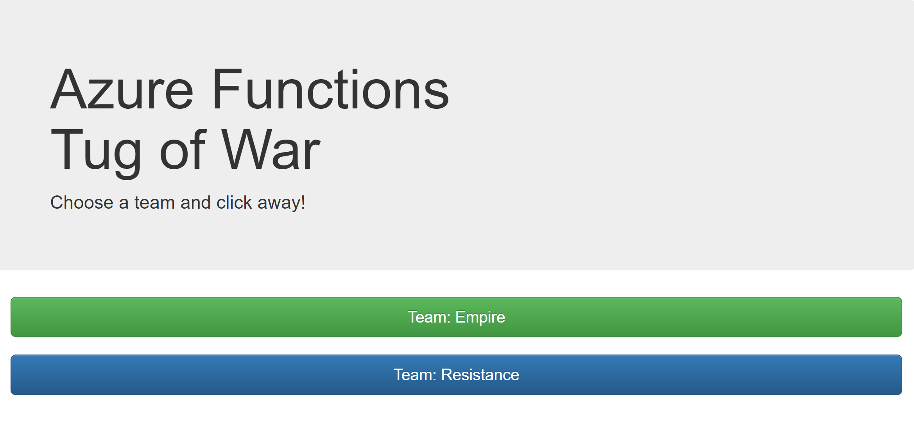
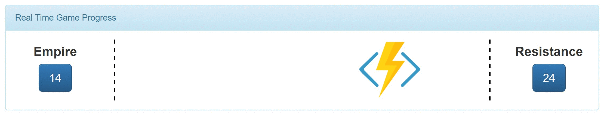
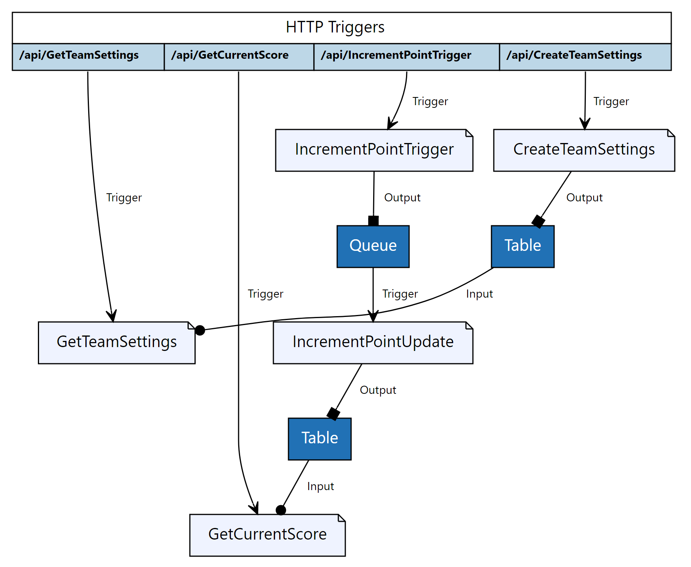

# Tug of War with Azure Functions (nodeJs) #

Play a live demo here: [https://aka.ms/aztugofwar](https://aka.ms/aztugofwar).

C# Class Library version here: [https://github.com/joescars/TugOfWar-CSharp](https://github.com/joescars/TugOfWar-CSharp).

## About the Demo ##

This simple demo game is used to teach basic concepts around building Azure Functions with node.js. 

It also provides a fun an interactive way to show Azure Functions in use. 

The following concepts are covered through this demo:

- Function Triggers
- Function Input & Output Bindings
- Reverse Proxies
- Serving Static Content via Proxy
- Debugging using VS Code
- Application Insights

## Setup Instructions ##

1. Click *Deploy to Azure* above to deploy directly to your Azure subscription.
2. Once deployed, you must manually create a storage container called **content** and upload all the files inside the *client* folder. 
    - I recommend using the [Azure Storage Explorer](http://storageexplorer.com/). 
3. Make sure to **change the url** in *index.html* where it says "Instruct your players to visit" to your shorturl or direct link to your *play.html* page. 

## How to Play ##

- From the home page (*index.html*) the presenter creates two Teams. For example. Team A and Team B. 

- Upon submitting these teams a new "Game" is created. 

- The presenter then instructions players to visit play.html. They will see two buttons, one for Team A and one for Team B. 
    - *Note; in the image below the url is specifically to my personal demo of the game. You will need to replace that url with your own when deploying*

- The goal is to have 1/2 the room hit one button and the other half the second button as fast as they can. 

- Each button press is logged and displayed in real time on the home page. When one team gets far enough ahead of the other team the Functions logo will move and eventually show a winner! 

## Images ##

*Teams are created*

*Players click their team button as fast as possible*

*The logo animates towards the team with more clicks*

## How does it work? ##

Behind the scenes we are using Azure Functions with Storage Queues, Table Storage and Proxies.

*Architecture Diagram generated using [https://functions-visualizer.azurewebsites.net/](https://functions-visualizer.azurewebsites.net/)*

## Resources ##

- [Azure Functions Documentation](https://docs.microsoft.com/en-us/azure/azure-functions/)
- [Azure Storage Explorer](http://storageexplorer.com/)
- Contact me on twitter [@joescars](https://www.twitter.com/joescars)

## Easy Deploy ##
